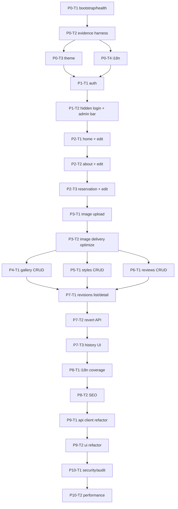

# 미닝(mining) 운정점 — OpenClaw Evidence Playbook (FINAL)
Generated: 2026-03-04 (Asia/Seoul)  
Mode: SINGLE  
Project: 최신 트렌디 UI · 1인 디자이너 예약제 미용실 홍보 웹사이트 (고객 유치 목적)

> 이 문서는 “Task 1개 = PR 1개”를 강제하며, **각 태스크를 end-to-end(SSOT→테스트→백엔드→프론트→연결→Evidence PASS)**로 닫기 위한 운영 규칙 + 백로그 SSOT입니다.  
> 사람 QA 태스크는 만들지 않습니다. 완료 판정은 오직 Evidence `summary.json PASS`로만 합니다.

---

## 0. SSOT(단일 진실 원천)와 충돌 해결 규칙

### 0.1 이 프로젝트의 SSOT 파일 세트 (정답 파일)
우선순위(강 → 약):

1) `openapi/openapi.yaml`  
- **API 계약(엔드포인트/스키마/에러코드) + 상태머신 + DB/인덱스** SSOT  
- 구현이 이것과 다르면 **구현이 틀린 것**으로 간주

2) `docs/ui/IA_NAV_SSOT.md`  
- 라우트/메뉴/관리자 전용 IA (숨김 로그인 포함) SSOT

3) `docs/ui/COPY_KEYS_SSOT.md`  
- UI 카피/i18n 키 SSOT (하드코딩 문자열 금지)

4) `design/derived/**`  
- **USE_UI_STITCH=false**이므로, Stitch 대신 “파생(derived) UI 스펙”을 SSOT로 둔다.
- 경로 규칙:
  - `design/derived/pages/<route>.md`
  - `design/derived/states/<route>__<state>.md`
  - `design/derived/_inventory.md` (라우트×상태 커버리지 체크리스트)

5) `docs/mining_website_OpenClaw_Evidence_Playbook_FINAL.md` (본 문서)  
- 태스크 분할/진행 순서 SSOT

6) `docs/mining_website_OpenClaw_TDD_Addendum_FINAL.md`  
- Evidence 규격/판정 규칙 SSOT

### 0.2 “PASS” 정의(통일)
태스크 완료(PASS)는 아래 2개를 동시에 만족해야 한다:

- `evidence/<piece_id>/<task_id>/summary.json` 에서  
  - top-level `"pass": true`  
  - top-level `"result": "PASS"`

둘 중 하나라도 아니면 FAIL.

### 0.3 UI 설계 SSOT (Stitch 없음) — HARD
- UI는 특정 외주 시안에 의존하지 않는다.  
- 대신, `design/derived/**`에 각 페이지/상태의 레이아웃·컴포넌트·토큰 사용을 **명시적으로 기록**한다.
- “최신 트렌디 UI/UX 벤치마킹”은 **코드로 재현 가능한 형태**로만 인정:
  - 반응형(모바일 우선)
  - 다크 기본 + 라이트 토글
  - 정보 구조(CTA/신뢰요소/갤러리/가격/리뷰/위치) 명확
  - 접근성(키보드/포커스/명도 대비 최소) 확보
  - 성능(이미지 최적화/지연 로딩) 포함

---

## 0.4 공통 제품 요구사항 (변경 금지)
필수 메뉴(Visitor nav 기준):
- 메인
- 소개 (디자이너 프로필 + 인스타 링크, 매장 위치 + 네이버 지도 연결)
- 갤러리 (사진 업로드)
- 스타일 (이미지 + 가격)
- 리뷰
- 예약 (네이버 스토어 링크)
- 로그인 (**숨김 라우트**, 주소로만 접근 가능)
- 되돌리기(Undo/History) (**관리자만**)

권한:
- 방문자(Visitor): Read-only (R)
- 관리자(Admin): CRUD + Undo/History + 모든 페이지 “수정” UI 노출

기능 요구:
- 모든 페이지는 **관리자 로그인 시** 인라인/오버레이 편집(텍스트 수정/사진 업로드/교체/정렬 등) 제공
- 변경 이력 저장 + “시간 요약(무엇이 바뀌었는지)” 제공
- 되돌리기(특정 시점/리비전으로 복원) 가능
- 테마: Dark/Light (기본 Dark)
- i18n: ko-KR / en-US

---

## 0.5 레포 권장 구조(SSOT: Playbook)
> 실제 구현은 이 구조를 기준으로 하되, “태스크 카드의 scope에 명시된 파일만” 변경한다(최대 10개 권장).

- `/openapi/openapi.yaml`
- `/docs/`
  - `mining_website_OpenClaw_Evidence_Playbook_FINAL.md`
  - `mining_website_OpenClaw_TDD_Addendum_FINAL.md`
  - `/ui/IA_NAV_SSOT.md`
  - `/ui/COPY_KEYS_SSOT.md`
- `/design/derived/`
  - `_inventory.md`
  - `/pages/`
  - `/states/`
- `/packages/`
  - `/api-server/` (HTTP API)
  - `/domain/` (DDD: entity/service/repository)
  - `/ui/` (웹 UI)
  - `/ui-kit/` (토큰/컴포넌트)
- `/evidence/`
- `/scripts/`

---

## 1) Mode Plan (SINGLE) — 역할/샤딩/충돌 방지

### 1.1 SINGLE 모드 역할 정의
SINGLE 모드는 “한 에이전트가 1 Task를 끝까지 닫는” 방식이다.

- 동일 태스크 내에서 반드시 수행(순서 고정):
  1) SSOT 확인/업데이트: OpenAPI + IA_NAV + COPY_KEYS + derived UI spec
  2) 테스트/증거 먼저 작성(FAIL 정상)
  3) 백엔드(DDD: domain→service→repo)
  4) 프론트(UI 구현: ui-kit 기반, 최신 트렌디 UX 반영)
  5) 연결(API client → 화면 바인딩)
  6) Evidence PASS (`summary.json`: `pass=true` AND `result="PASS"`)
  7) PR 생성(1 Task = 1 PR)

### 1.2 Claim/Lock 프로토콜(충돌 방지)
SINGLE이어도 자동 재시도/중복 실행이 생길 수 있으므로 “태스크 잠금”을 강제한다.

- Lock 파일: `.openclaw/locks/<task_id>.lock`
- 시작 시:
  - lock 없으면 생성(내용: task_id, 시작시각, branch, actor)
  - lock 있으면 **중단**(중복 실행 방지)
- 종료 시:
  - PASS면 lock 삭제
  - FAIL이면 lock 유지(원인/재시도 기록 포함) 후 종료

### 1.3 브랜치/PR 규칙
- branch: `feature/<task_id>-<short-slug>`
  - 예: `feature/P2-T1-home-hero`
- PR title: `[<task_id>] <title>`
- PR 본문 필수:
  - SSOT 변경 목록(OpenAPI/IA/COPY/derived)
  - Evidence 경로 + `summary.json` PASS
  - 사용한 run.sh 커맨드 목록

### 1.4 머지 순서 규칙
- 기본 원칙: 동시에 open PR 2개 금지(단일 작업자 충돌 방지)
- 예외(병렬 구간): Dependency Graph에서 “fan-out”으로 명시된 태스크는 **동시에** open PR을 허용한다.
  - 단, 아래 조건을 모두 만족해야 한다:
    - 각 PR은 **서로 다른 task_id** (lock 파일로 강제)
    - SSOT 파일(`openapi/openapi.yaml`, `docs/ui/IA_NAV_SSOT.md`, `docs/ui/COPY_KEYS_SSOT.md`, 공통 토큰/인프라 파일)을 동시에 수정하지 않는다
    - 충돌이 발생하면 SSOT를 건드린 PR을 먼저 merge하고, 나머지는 rebase 후 진행한다
- merge는 Playbook의 Dependency Graph를 준수한다(선행 노드 미완료 상태에서 후행 노드 merge 금지)


### 1.5 병렬 실행(Parallelization) 규칙 — SINGLE 모드 내 Fan-out
- SINGLE은 “**1 태스크 = 1 에이전트(또는 1 PR)**”을 의미한다. (동시에 여러 태스크를 여러 에이전트가 수행하는 것은 가능)
- 병렬 실행은 **Bounded Context가 분리되고 파일 충돌 위험이 낮은 구간**에서만 허용한다.
- 병렬 구간의 권장 운영:
  - (A) 계약/SSOT 변경이 필요한 PR을 먼저 분리·병합
  - (B) 이후 구현 PR을 fan-out으로 동시에 진행
  - (C) fan-in 이후(모든 fan-out 태스크 merge 완료) 후행 태스크를 진행

---

## 2) Backlog (Pieces & Tasks) — SSOT 기반 태스크 카드

### 2.1 Pieces 개요(요약)
- P0: 프로젝트 기반/SSOT/증거 하네스
- P1: 인증/권한(숨김 로그인 포함)
- P2: 콘텐츠(Page) 모델 + 메인/소개/예약(관리자 인라인 편집)
- P3: 미디어 업로드(이미지) + 보안/최적화
- P4: 갤러리(사진) CRUD + UI
- P5: 스타일(가격/이미지) CRUD + UI
- P6: 리뷰 CRUD + UI
- P7: 되돌리기(히스토리/리비전/복원) + “시간 요약”
- P8: 테마/i18n 고도화 + SEO
- P9: 성능/접근성/구조 리팩토링(유지보수)
- P10: 운영/관측/보안 하드닝

> HARD: 각 Task는 “한 봇이 60분 내 evidence PASS” 가능하도록 작게 유지한다.  
> HARD: UI 구현 태스크도 반드시 “레이아웃/스타일링/인터랙션”을 포함한다(기능만 구현 금지).

---

### P0 — Foundation (SSOT/Repo/Evidence Gate)

#### P0-T1
```yaml
piece_id: P0
task_id: P0-T1
title: Repo bootstrap + OpenAPI gate + /health (E2E)
goal: >
  레포 기반을 만들고 OpenAPI SSOT를 도입한 뒤,
  가장 작은 end-to-end(서버+UI) 경로로 /health를 확인한다.
ssot_refs:
  openapi:
    - paths./health.get
    - components.schemas.HealthResponse
  ia_nav:
    routes:
      - /
  copy_keys:
    - app.brandName
    - msg.healthOk
  derived_ui:
    - design/derived/pages/root.md
scope:
  files_max_10:
    - openapi/openapi.yaml
    - docs/ui/IA_NAV_SSOT.md
    - docs/ui/COPY_KEYS_SSOT.md
    - design/derived/_inventory.md
    - design/derived/pages/root.md
    - packages/api-server/src/http/health.ts
    - packages/ui/src/routes/Root.tsx
    - packages/ui/src/api/health.ts
    - scripts/run_openapi_lint.sh
    - evidence/P0/P0-T1/run.sh
evidence:
  commands_3_to_6:
    - bash scripts/run_openapi_lint.sh
    - bash evidence/P0/P0-T1/run.sh
acceptance:
  - GET /health returns 200 with { ok: true } (schema-matched).
  - Root page renders and shows a small “system ok” badge using i18n keys (no hardcoded strings).
  - Derived UI spec exists for / route (dark default noted).
pass_criteria:
  - evidence/P0/P0-T1/summary.json has pass=true and result=PASS
  - OpenAPI lint passes
```

#### P0-T2
```yaml
piece_id: P0
task_id: P0-T2
title: Evidence harness + contract-case runner (YAML → curl/jq) + summary.json generator
goal: >
  모든 태스크가 동일 포맷으로 evidence를 생성할 수 있도록
  공통 하네스(케이스 러너/요약 생성)를 제공한다.
```

#### P0-T5
```yaml
piece_id: P0
task_id: P0-T5
title: Runtime bootstrap (API+UI+SQLite) — startable from latest main
goal: >
  최신 main을 클론한 사람이 "한 번에" 런타임을 띄워 QA/개발할 수 있도록,
  API 서버 + UI(dev) + SQLite DB 파일 준비를 end-to-end로 고정한다.
ssot_refs:
  openapi:
    - paths./health.get
  ia_nav:
    routes:
      - /
  copy_keys:
    - app.brandName
    - msg.healthOk
  derived_ui:
    - design/derived/pages/root.md
scope:
  files_max_10:
    - package.json
    - scripts/dev.mjs
    - packages/api-server/src/index.js
    - packages/ui/package.json
    - packages/ui/vite.config.ts
    - packages/ui/src/main.tsx
    - locales/ko-KR.json
    - locales/en-US.json
    - evidence/P0/P0-T5/run.sh
    - evidence/P0/P0-T5/expected.md
evidence:
  commands_3_to_6:
    - bash evidence/P0/P0-T5/run.sh
acceptance:
  - `npm run dev`로 API(:8080) + UI(:5173)가 기동된다.
  - `data/mining.sqlite` 파일이 생성된다.
  - /api/health가 200이며 db.ok=true를 반환한다.
pass_criteria:
  - evidence/P0/P0-T5/summary.json has pass=true and result=PASS
```

#### P0-T2
```yaml
piece_id: P0
task_id: P0-T2
title: Evidence harness + contract-case runner (YAML → curl/jq) + summary.json generator
goal: >
  모든 태스크가 동일 포맷으로 evidence를 생성할 수 있도록
  공통 하네스(케이스 러너/요약 생성)를 제공한다.
ssot_refs:
  openapi:
    - openapi/openapi.yaml (entire)
  ia_nav:
    routes:
      - /
  copy_keys: []
  derived_ui: []
scope:
  files_max_10:
    - scripts/contract/run_cases.sh
    - scripts/contract/assert_jq.sh
    - scripts/contract/assert_regex.sh
    - scripts/contract/write_summary_json.mjs
    - scripts/_evidence_lib.sh
    - evidence/P0/P0-T2/expected.md
    - evidence/P0/P0-T2/cases/P0-T2-HEALTH-001.case.yaml
    - evidence/P0/P0-T2/run.sh
    - evidence/P0/P0-T2/summary.json
    - docs/mining_website_OpenClaw_TDD_Addendum_FINAL.md (linking note section only)
evidence:
  commands_3_to_6:
    - bash evidence/P0/P0-T2/run.sh
acceptance:
  - case.yaml 1개를 실행해 PASS/FAIL을 자동 판정한다.
  - actual/http 에 status/headers/body가 저장된다.
  - summary.json(pass/result/checks)이 자동 생성된다.
pass_criteria:
  - summary.json PASS
```

#### P0-T3
```yaml
piece_id: P0
task_id: P0-T3
title: UI-kit token scaffold (Dark default) + theme toggle baseline
goal: >
  다크/라이트 테마 토큰을 ui-kit로 고정하고,
  UI에서 토글 가능한 최소 기능을 제공한다(기본 다크).
ssot_refs:
  openapi: []
  ia_nav:
    routes:
      - /
  copy_keys:
    - action.toggleTheme
    - status.themeDark
    - status.themeLight
  derived_ui:
    - design/derived/states/root__theme-toggle.md
scope:
  files_max_10:
    - docs/ui/COPY_KEYS_SSOT.md
    - design/derived/states/root__theme-toggle.md
    - packages/ui-kit/src/tokens/theme.css
    - packages/ui-kit/src/components/ThemeProvider.tsx
    - packages/ui-kit/src/components/ThemeToggle.tsx
    - packages/ui/src/app/AppShell.tsx
    - packages/ui/src/routes/Root.tsx
    - packages/ui/src/state/theme.ts
    - evidence/P0/P0-T3/run.sh
    - evidence/P0/P0-T3/cases/P0-T3-UI-001.case.yaml
evidence:
  commands_3_to_6:
    - pnpm -C packages/ui-kit lint
    - pnpm -C packages/ui-kit test
    - pnpm -C packages/ui lint
    - pnpm -C packages/ui test
acceptance:
  - 첫 렌더 기본 테마는 Dark.
  - 토글 시 라이트/다크 전환이 즉시 반영(토큰 기반).
  - 사용자 선택은 local storage 또는 cookie로 유지(정책은 derived spec에 명시).
pass_criteria:
  - summary.json PASS
  - lint/typecheck/test PASS
```

#### P0-T4
```yaml
piece_id: P0
task_id: P0-T4
title: i18n scaffold (ko/en) + COPY_KEYS enforcement test
goal: >
  모든 UI 문자열이 키 기반으로만 표시되도록 i18n 구조를 고정하고,
  SSOT(COPY_KEYS)와 locale JSON 정합성을 테스트로 강제한다.
ssot_refs:
  openapi: []
  ia_nav:
    routes:
      - /
  copy_keys:
    - (baseline namespaces) app.*, nav.*, action.*, msg.*, err.*, field.*, status.*
  derived_ui:
    - design/derived/states/root__i18n-toggle.md
scope:
  files_max_10:
    - docs/ui/COPY_KEYS_SSOT.md
    - packages/ui/src/i18n/index.ts
    - packages/ui/src/i18n/locales/ko-KR.json
    - packages/ui/src/i18n/locales/en-US.json
    - packages/ui/src/i18n/copy-keys.spec.ts
    - packages/ui-kit/src/i18n/index.ts
    - packages/ui/src/routes/Root.tsx
    - design/derived/states/root__i18n-toggle.md
    - evidence/P0/P0-T4/run.sh
    - evidence/P0/P0-T4/summary.json
evidence:
  commands_3_to_6:
    - pnpm -C packages/ui test
    - pnpm -C packages/ui typecheck
acceptance:
  - ko/en 전환이 가능하며, UI는 키로만 문자열을 출력한다.
  - COPY_KEYS_SSOT에 존재하는 키는 locale JSON에 100% 존재(테스트로 강제).
pass_criteria:
  - summary.json PASS
```

---

### P1 — Auth & RBAC (숨김 로그인 포함)

#### P1-T1
```yaml
piece_id: P1
task_id: P1-T1
title: Admin auth (login/logout/me) + API 보호(쓰기 endpoints deny by default)
goal: >
  관리자 인증을 도입하고, 쓰기/관리자 API를 전부 보호한다.
  방문자(미인증)는 오직 public read만 가능.
ssot_refs:
  openapi:
    - paths./auth/login.post
    - paths./auth/logout.post
    - paths./admin/me.get
    - components.schemas.LoginRequest
    - components.schemas.LoginResponse
    - components.schemas.ErrorResponse
  ia_nav:
    routes:
      - / (public)
      - /__admin/login (hidden access only)
  copy_keys:
    - msg.loginTitle
    - field.username
    - field.password
    - action.login
    - action.logout
    - err.unauthorized
  derived_ui:
    - design/derived/pages/__admin_login.md
scope:
  files_max_10:
    - openapi/openapi.yaml
    - design/derived/pages/__admin_login.md
    - packages/api-server/src/http/auth/login.ts
    - packages/api-server/src/http/auth/logout.ts
    - packages/api-server/src/http/auth/me.ts
    - packages/api-server/src/http/middleware/auth.ts
    - packages/domain/src/auth/AuthService.ts
    - packages/domain/src/user/UserRepository.ts
    - packages/ui/src/routes/admin/LoginPage.tsx
    - evidence/P1/P1-T1/run.sh
evidence:
  commands_3_to_6:
    - bash scripts/run_openapi_lint.sh
    - bash evidence/P1/P1-T1/run.sh
acceptance:
  - 로그인 성공 시 admin 세션/토큰이 발급되고 /admin/me가 admin을 반환.
  - 로그인 실패(잘못된 비번)는 401 + ErrorResponse 스키마 준수.
  - 보호된 admin/write API는 미인증 요청에 401.
  - UI 로그인 페이지는 i18n 키만 사용.
pass_criteria:
  - summary.json PASS
```

#### P1-T2
```yaml
piece_id: P1
task_id: P1-T2
title: Hidden login routing + public nav excludes login + admin bar skeleton
goal: >
  로그인 페이지는 주소로만 접근 가능(네비에 노출 금지),
  관리자 로그인 시 전역 admin bar(편집/히스토리 진입)를 노출한다.
ssot_refs:
  openapi:
    - paths./admin/me.get
  ia_nav:
    routes:
      - /__admin/login (hidden)
      - /__admin/revisions (admin only)
    nav_rules:
      - public header nav must not contain login link
  copy_keys:
    - action.enterEditMode
    - nav.rollback
    - err.forbidden
  derived_ui:
    - design/derived/states/app__admin-bar.md
scope:
  files_max_10:
    - docs/ui/IA_NAV_SSOT.md
    - docs/ui/COPY_KEYS_SSOT.md
    - design/derived/states/app__admin-bar.md
    - packages/ui/src/app/AppShell.tsx
    - packages/ui/src/app/AdminBar.tsx
    - packages/ui/src/routes/admin/LoginPage.tsx
    - packages/ui/src/routes/admin/HistoryPage.tsx (placeholder)
    - packages/ui/src/api/auth.ts
    - packages/ui/src/tests/nav-hidden-login.spec.ts
    - evidence/P1/P1-T2/run.sh
evidence:
  commands_3_to_6:
    - pnpm -C packages/ui test
    - pnpm -C packages/ui lint
acceptance:
  - Public header/footer/nav 어디에도 “로그인” 링크가 없다.
  - /__admin/login은 직접 접근 시 렌더되며, 로그인 성공 후 admin bar가 보인다.
  - /__admin/revisions는 admin만 접근 가능(미인증/비관리자는 forbidden UI).
pass_criteria:
  - summary.json PASS
```

---

### P2 — Pages (메인/소개/예약) + 관리자 인라인 편집(기본)

> P2부터는 “모든 페이지에서 관리자 로그인 시 수정 버튼 제공”을 실제로 구현한다.  
> 이 단계에서 “되돌리기(History)”는 기록만 하고, 복원 UI는 P7에서 닫는다.

#### P2-T1
```yaml
piece_id: P2
task_id: P2-T1
title: Main page (/) public render + admin hero edit (text) + revision 기록(요약)
goal: >
  메인 랜딩 페이지를 트렌디 UI로 구성하고,
  관리자 인라인 편집으로 hero 텍스트를 수정/저장하며,
  변경 요약(revision summary)을 저장한다.
ssot_refs:
  openapi:
    - paths./public/home.get
    - paths./admin/home.patch
    - paths./admin/revisions.get
    - components.schemas.HomePage
    - components.schemas.UpdateHomePageRequest
    - components.schemas.RevisionEntry
  ia_nav:
    routes:
      - /
  copy_keys:
    - nav.home
    - action.bookNow
    - msg.changesSaved
  derived_ui:
    - design/derived/pages/home.md
    - design/derived/states/home__admin-edit.md
scope:
  files_max_10:
    - openapi/openapi.yaml
    - design/derived/pages/home.md
    - design/derived/states/home__admin-edit.md
    - packages/domain/src/page/PageService.ts
    - packages/domain/src/revision/RevisionService.ts
    - packages/api-server/src/http/pages/publicPages.ts
    - packages/api-server/src/http/pages/adminPages.ts
    - packages/ui/src/routes/home/HomePage.tsx
    - packages/ui/src/components/AdminInlineEditor.tsx
    - evidence/P2/P2-T1/run.sh
evidence:
  commands_3_to_6:
    - bash evidence/P2/P2-T1/run.sh
acceptance:
  - 방문자는 메인 페이지를 읽기만 가능(편집 UI 미노출).
  - 관리자는 hero 타이틀/서브타이틀을 수정 후 저장 가능.
  - 저장 시 revision이 자동 생성되고, summary에 변경 항목(예: hero_title)이 포함된다.
  - CTA “예약”은 /booking 페이지 또는 외부 링크 정책에 맞게 노출(derived spec에 명시).
pass_criteria:
  - summary.json PASS
  - UI: 모바일(360px)에서 히어로 CTA가 첫 화면에 존재, overflow 없음
```

#### P2-T2
```yaml
piece_id: P2
task_id: P2-T2
title: About page (/about) — designer profile + Instagram link + Naver map link + admin edit
goal: >
  소개 페이지에 디자이너 프로필(인스타 링크)과 매장 위치(네이버 지도 연결)를 제공하고,
  관리자 편집(텍스트/링크)을 지원한다.
ssot_refs:
  openapi:
    - paths./public/about.get
    - paths./admin/about.patch
    - paths./public/designers.get
    - paths./admin/designers.get
    - paths./admin/designers.post
    - paths./admin/designers/{designerId}.patch
  ia_nav:
    routes:
      - /about
  copy_keys:
    - nav.about
    - about.designer.title
    - about.designer.instagram
    - about.location.title
    - action.openNaverMap
  derived_ui:
    - design/derived/pages/about.md
scope:
  files_max_10:
    - docs/ui/IA_NAV_SSOT.md
    - docs/ui/COPY_KEYS_SSOT.md
    - design/derived/pages/about.md
    - openapi/openapi.yaml
    - packages/ui/src/routes/about/AboutPage.tsx
    - packages/ui/src/components/ExternalLinkCard.tsx
    - packages/api-server/src/http/pages/publicPages.ts
    - packages/api-server/src/http/pages/adminPages.ts
    - packages/domain/src/page/PageService.ts
    - evidence/P2/P2-T2/run.sh
evidence:
  commands_3_to_6:
    - bash evidence/P2/P2-T2/run.sh
acceptance:
  - 인스타그램은 외부 링크로 열리며, URL은 관리자 편집 가능.
  - 네이버 지도는 “연결 링크”를 제공(외부 링크 정책 + rel 안전 속성 적용).
  - 관리자 편집 시 revision summary 기록.
pass_criteria:
  - summary.json PASS
```

#### P2-T3
```yaml
piece_id: P2
task_id: P2-T3
title: Booking page (/booking) — Naver store link + CTA emphasis + admin edit
goal: >
  예약 페이지에서 네이버 스토어(예약) 링크를 강한 CTA로 제공하고,
  관리자 편집(링크/문구)을 지원한다.
ssot_refs:
  openapi:
    - paths./public/about.get
    - paths./admin/about.patch
    - paths./public/designers.get
    - paths./admin/designers.get
    - paths./admin/designers.post
    - paths./admin/designers/{designerId}.patch
  ia_nav:
    routes:
      - /booking
  copy_keys:
    - nav.booking
    - msg.bookingHint
    - action.openNaverBooking
    - msg.externalLinkHint
  derived_ui:
    - design/derived/pages/booking.md
scope:
  files_max_10:
    - docs/ui/IA_NAV_SSOT.md
    - docs/ui/COPY_KEYS_SSOT.md
    - design/derived/pages/booking.md
    - openapi/openapi.yaml
    - packages/ui/src/routes/booking/BookingPage.tsx
    - packages/ui/src/components/CtaCard.tsx
    - packages/api-server/src/http/pages/publicPages.ts
    - packages/api-server/src/http/pages/adminPages.ts
    - packages/domain/src/page/PageService.ts
    - evidence/P2/P2-T3/run.sh
evidence:
  commands_3_to_6:
    - bash evidence/P2/P2-T3/run.sh
acceptance:
  - 예약 CTA는 모바일에서 “첫 화면(above the fold)”에 존재.
  - 링크는 새 탭 열기 + 안전 속성 적용.
  - 관리자 편집/저장/이력 기록 PASS.
pass_criteria:
  - summary.json PASS
```

---

### P3 — Media Upload (이미지 업로드/교체) + 보안/최적화

#### P3-T1
```yaml
piece_id: P3
task_id: P3-T1
title: Admin image upload API + UI uploader (gallery/style/page shared)
goal: >
  관리자 전용 이미지 업로드(파일 검증 포함) API를 제공하고,
  UI에서 재사용 가능한 업로더 컴포넌트를 만든다.
ssot_refs:
  openapi:
    - paths./admin/media.post
    - paths./admin/media/by-hash/{sha256}.get
    - components.schemas.MediaUploadRequest
    - components.schemas.MediaAsset
    - components.schemas.ErrorResponse
  ia_nav:
    routes:
      - (admin edit overlay)
  copy_keys:
    - action.uploadImage
    - err.validation
    - msg.uploading
  derived_ui:
    - design/derived/states/admin__image-uploader.md
scope:
  files_max_10:
    - openapi/openapi.yaml
    - design/derived/states/admin__image-uploader.md
    - packages/api-server/src/http/media/uploadImage.ts
    - packages/api-server/src/http/middleware/auth.ts
    - packages/domain/src/media/MediaService.ts
    - packages/domain/src/media/MediaRepository.ts
    - packages/ui/src/components/ImageUploader.tsx
    - packages/ui/src/api/media.ts
    - evidence/P3/P3-T1/run.sh
    - evidence/P3/P3-T1/cases/P3-T1-UPLOAD-001.case.yaml
evidence:
  commands_3_to_6:
    - bash evidence/P3/P3-T1/run.sh
acceptance:
  - 이미지는 admin만 업로드 가능(미인증 401).
  - 파일 크기/확장자/콘텐츠 타입 최소 검증(정책은 OpenAPI + derived spec에 명시).
  - 업로드 성공 시 MediaAsset을 반환, UI에서 즉시 미리보기.
  - (권장) sha256 기반 dedupe: 동일 해시가 이미 존재하면 200 OK + 기존 MediaAsset 반환.
pass_criteria:
  - summary.json PASS
```

#### P3-T2
```yaml
piece_id: P3
task_id: P3-T2
title: Image delivery optimization (responsive sizes, caching headers) + UI lazy-loading
goal: >
  이미지 제공을 성능 친화적으로 구성하고,
  UI에서 지연 로딩과 적절한 사이즈를 사용한다.
ssot_refs:
  openapi:
    - paths./public/media/{mediaId}.get
  ia_nav:
    routes:
      - /gallery
      - /styles
  copy_keys: []
  derived_ui:
    - design/derived/states/media__responsive.md
scope:
  files_max_10:
    - openapi/openapi.yaml
    - design/derived/states/media__responsive.md
    - packages/api-server/src/http/media/getImage.ts
    - packages/api-server/src/http/middleware/cache.ts
    - packages/ui/src/components/ResponsiveImage.tsx
    - packages/ui/src/components/ImageGrid.tsx
    - packages/ui/src/routes/gallery/GalleryPage.tsx (prep/placeholder)
    - packages/ui/src/routes/styles/StylesPage.tsx (prep/placeholder)
    - evidence/P3/P3-T2/run.sh
    - evidence/P3/P3-T2/summary.json
evidence:
  commands_3_to_6:
    - pnpm -C packages/ui test
    - bash evidence/P3/P3-T2/run.sh
acceptance:
  - public image 응답에 캐시 헤더가 포함(정책은 OpenAPI에 명시).
  - UI는 lazy-loading(아래 스크롤에서 로드) + 적절한 sizes/srcset 전략을 사용.
pass_criteria:
  - summary.json PASS
```

---

### P4 — Gallery (사진 업로드/노출) CRUD

#### P4-T1
```yaml
piece_id: P4
task_id: P4-T1
title: Gallery public list + Admin CRUD (create/update/delete) + reorder
goal: >
  갤러리 페이지에서 사진을 그리드로 노출하고,
  관리자는 사진 추가/교체/삭제/정렬을 할 수 있다.
ssot_refs:
  openapi:
    - paths./public/gallery/items.get
    - paths./admin/gallery/items.get
    - paths./admin/gallery/items.post
    - paths./admin/gallery/items/{galleryItemId}.get
    - paths./admin/gallery/items/{galleryItemId}.patch
    - paths./admin/gallery/items/{galleryItemId}.delete
    - paths./admin/gallery/items/reorder.post
    - components.schemas.GalleryItem
  ia_nav:
    routes:
      - /gallery
  copy_keys:
    - nav.gallery
    - msg.galleryEmpty
    - action.add
    - action.delete
    - action.save
  derived_ui:
    - design/derived/pages/gallery.md
    - design/derived/states/gallery__admin-edit.md
scope:
  files_max_10:
    - openapi/openapi.yaml
    - design/derived/pages/gallery.md
    - packages/domain/src/gallery/GalleryService.ts
    - packages/api-server/src/http/gallery/publicGallery.ts
    - packages/api-server/src/http/gallery/adminGallery.ts
    - packages/ui/src/routes/gallery/GalleryPage.tsx
    - packages/ui/src/components/GalleryEditorDrawer.tsx
    - packages/ui/src/api/gallery.ts
    - evidence/P4/P4-T1/run.sh
    - evidence/P4/P4-T1/cases/P4-T1-GALLERY-001.case.yaml
evidence:
  commands_3_to_6:
    - bash evidence/P4/P4-T1/run.sh
acceptance:
  - 방문자는 갤러리를 읽기 전용으로 본다.
  - 관리자는 사진을 추가/삭제/정렬하고 저장할 수 있다.
  - 빈 상태/로딩 상태/에러 상태가 표준 컴포넌트로 표현된다.
pass_criteria:
  - summary.json PASS
  - UI: 모바일에서 2열 그리드, 데스크톱에서 3~4열(derived spec에 명시)
```

---

### P5 — Styles (이미지 + 가격 정보) CRUD

#### P5-T1
```yaml
piece_id: P5
task_id: P5-T1
title: Styles page public list + Admin CRUD (service name/price/image)
goal: >
  스타일(시술) 목록을 카드/리스트로 노출하고,
  관리자는 항목(이름/가격/이미지/설명)을 CRUD한다.
ssot_refs:
  openapi:
    - paths./public/styles/items.get
    - paths./admin/styles/items.get
    - paths./admin/styles/items.post
    - paths./admin/styles/items/{styleItemId}.get
    - paths./admin/styles/items/{styleItemId}.patch
    - paths./admin/styles/items/{styleItemId}.delete
    - components.schemas.StyleItem
  ia_nav:
    routes:
      - /styles
  copy_keys:
    - nav.styles
    - field.price
    - msg.stylesEmpty
    - action.add
    - action.save
  derived_ui:
    - design/derived/pages/styles.md
scope:
  files_max_10:
    - openapi/openapi.yaml
    - design/derived/pages/styles.md
    - packages/domain/src/style/StyleService.ts
    - packages/api-server/src/http/styles/publicStyles.ts
    - packages/api-server/src/http/styles/adminStyles.ts
    - packages/ui/src/routes/styles/StylesPage.tsx
    - packages/ui/src/components/StyleEditorModal.tsx
    - packages/ui/src/api/styles.ts
    - evidence/P5/P5-T1/run.sh
    - evidence/P5/P5-T1/summary.json
evidence:
  commands_3_to_6:
    - bash evidence/P5/P5-T1/run.sh
acceptance:
  - 가격 표시는 통화 포맷(ko/en) 정책을 따른다(derived spec에 명시).
  - 관리자는 가격/설명/이미지 수정 가능, 저장 시 revision 기록.
pass_criteria:
  - summary.json PASS
```

---

### P6 — Reviews (관리자 등록/편집) CRUD

#### P6-T1
```yaml
piece_id: P6
task_id: P6-T1
title: Reviews page public list + Admin CRUD (rating/text/source)
goal: >
  리뷰 페이지에 후기(평점/본문/작성자/출처)를 노출하고,
  방문자는 읽기 전용, 관리자는 CRUD한다.
ssot_refs:
  openapi:
    - paths./public/reviews/items.get
    - paths./admin/reviews/items.get
    - paths./admin/reviews/items.post
    - paths./admin/reviews/items/{reviewItemId}.get
    - paths./admin/reviews/items/{reviewItemId}.patch
    - paths./admin/reviews/items/{reviewItemId}.delete
    - components.schemas.ReviewItem
  ia_nav:
    routes:
      - /reviews
  copy_keys:
    - nav.reviews
    - msg.emptyReviews
    - field.rating
    - action.addReview
  derived_ui:
    - design/derived/pages/reviews.md
scope:
  files_max_10:
    - openapi/openapi.yaml
    - design/derived/pages/reviews.md
    - packages/domain/src/review/ReviewService.ts
    - packages/api-server/src/http/reviews/publicReviews.ts
    - packages/api-server/src/http/reviews/adminReviews.ts
    - packages/ui/src/routes/reviews/ReviewsPage.tsx
    - packages/ui/src/components/ReviewEditorDrawer.tsx
    - packages/ui/src/api/reviews.ts
    - evidence/P6/P6-T1/run.sh
    - evidence/P6/P6-T1/summary.json
evidence:
  commands_3_to_6:
    - bash evidence/P6/P6-T1/run.sh
acceptance:
  - 방문자는 리뷰를 읽기만 가능(추가 버튼 없음).
  - 관리자는 리뷰 추가/수정/삭제 가능.
  - 별점은 접근성(aria-label) 포함.
pass_criteria:
  - summary.json PASS
```

---

### P7 — 되돌리기(History/Undo) + 시간 요약

> P7는 “관리자만 보이는 되돌리기 페이지”를 완성한다.  
> 핵심: 변경 이력 목록 + 상세(요약/변경 필드) + 특정 리비전으로 복원.

#### P7-T1
```yaml
piece_id: P7
task_id: P7-T1
title: Revisions API (list/detail) + time summary grouping (server-side)
goal: >
  변경 이력을 서버에서 조회할 수 있도록 list/detail API를 제공하고,
  “시간 요약(최근 1시간/24시간 등)” 그룹핑에 필요한 데이터를 반환한다.
ssot_refs:
  openapi:
    - paths./admin/revisions.get
    - paths./admin/revisions/{id}.get
    - components.schemas.Revision
  ia_nav:
    routes:
      - /__admin/revisions
  copy_keys:
    - admin.history.title
    - field.createdAt
    - field.summary
  derived_ui:
    - design/derived/pages/__admin_history.md
scope:
  files_max_10:
    - openapi/openapi.yaml
    - design/derived/pages/__admin_history.md
    - packages/domain/src/revision/RevisionService.ts
    - packages/api-server/src/http/revisions/adminRevisions.ts
    - packages/api-server/src/http/middleware/auth.ts
    - packages/ui/src/api/revisions.ts
    - packages/ui/src/routes/admin/HistoryPage.tsx
    - packages/ui/src/components/RevisionList.tsx
    - evidence/P7/P7-T1/run.sh
    - evidence/P7/P7-T1/summary.json
evidence:
  commands_3_to_6:
    - bash evidence/P7/P7-T1/run.sh
acceptance:
  - admin만 revisions 조회 가능.
  - revisions 응답에 entity_type/entity_id/summary/created_at 포함.
  - grouping(최근/이번 주 등)은 UI에서 계산 가능하도록 created_at 제공.
pass_criteria:
  - summary.json PASS
```

#### P7-T2
```yaml
piece_id: P7
task_id: P7-T2
title: Revert API (restore to revision) + optimistic concurrency
goal: >
  특정 리비전으로 복원하는 API를 제공하고,
  충돌(동시에 편집) 상황에서 안전하게 실패/안내한다.
ssot_refs:
  openapi:
    - paths./admin/revisions/{id}/revert.post
    - components.schemas.RevertResponse
    - components.schemas.ErrorResponse
  ia_nav:
    routes:
      - /__admin/revisions
  copy_keys:
    - action.revert
    - err.conflict
    - msg.changesSaved
  derived_ui:
    - design/derived/states/__admin_history__revert-confirm.md
scope:
  files_max_10:
    - openapi/openapi.yaml
    - design/derived/states/__admin_history__revert-confirm.md
    - packages/domain/src/revision/RevertService.ts
    - packages/api-server/src/http/revisions/revertRevision.ts
    - packages/domain/src/page/PageRepository.ts (or shared repository)
    - packages/domain/src/gallery/GalleryRepository.ts (if needed)
    - packages/ui/src/components/RevertConfirmDialog.tsx
    - packages/ui/src/routes/admin/HistoryPage.tsx
    - evidence/P7/P7-T2/run.sh
    - evidence/P7/P7-T2/cases/P7-T2-REVERT-001.case.yaml
evidence:
  commands_3_to_6:
    - bash evidence/P7/P7-T2/run.sh
acceptance:
  - 리비전 복원 후 해당 콘텐츠가 즉시 public UI에 반영된다.
  - 충돌 상황은 409로 실패하며 UI는 err.conflict를 표시한다.
pass_criteria:
  - summary.json PASS
```

#### P7-T3
```yaml
piece_id: P7
task_id: P7-T3
title: Admin history UI (list/filter/detail) + “시간 요약” UX
goal: >
  관리자 전용 되돌리기 페이지를 완성한다:
  목록(필터/그룹) + 상세(변경 요약) + 복원 액션까지 UI로 닫는다.
ssot_refs:
  openapi:
    - paths./admin/revisions.get
    - paths./admin/revisions/{id}/revert.post
  ia_nav:
    routes:
      - /__admin/revisions
  copy_keys:
    - admin.history.title
    - field.createdAt
    - field.summary
    - action.revert
    - action.close
  derived_ui:
    - design/derived/pages/__admin_history.md
scope:
  files_max_10:
    - design/derived/pages/__admin_history.md
    - packages/ui/src/routes/admin/HistoryPage.tsx
    - packages/ui/src/components/RevisionList.tsx
    - packages/ui/src/components/RevisionDetail.tsx
    - packages/ui/src/components/RevertConfirmDialog.tsx
    - packages/ui/src/api/revisions.ts
    - packages/ui/src/tests/history-page.spec.tsx
    - evidence/P7/P7-T3/run.sh
    - evidence/P7/P7-T3/summary.json
    - docs/ui/COPY_KEYS_SSOT.md (필요 시 키 추가)
evidence:
  commands_3_to_6:
    - pnpm -C packages/ui test
    - pnpm -C packages/ui lint
acceptance:
  - 관리자만 페이지 접근 가능(미인증은 forbidden 화면).
  - 변경 이력은 “시간 요약”으로 묶여 표시(예: 최근 1시간/오늘/이번주).
  - 복원(confirm) 후 완료 토스트(msg.changesSaved) 표시.
pass_criteria:
  - summary.json PASS
```

---

### P8 — 테마/i18n 고도화 + SEO

#### P8-T1
```yaml
piece_id: P8
task_id: P8-T1
title: Language toggle (ko/en) persisted + all nav/pages keys coverage
goal: >
  언어 토글(ko/en)을 전역 설정으로 고정하고,
  모든 페이지/컴포넌트가 키 기반으로만 렌더되도록 커버리지를 올린다.
ssot_refs:
  openapi:
    - paths./public/site-config.get (optional)
  ia_nav:
    routes:
      - / (and all public routes)
  copy_keys:
    - nav.*
    - (page copy keys added as needed)
  derived_ui:
    - design/derived/states/app__language-toggle.md
scope:
  files_max_10:
    - docs/ui/COPY_KEYS_SSOT.md
    - packages/ui/src/i18n/locales/ko-KR.json
    - packages/ui/src/i18n/locales/en-US.json
    - packages/ui/src/app/LanguageToggle.tsx
    - packages/ui/src/app/AppShell.tsx
    - packages/ui/src/i18n/copy-keys.spec.ts
    - design/derived/states/app__language-toggle.md
    - evidence/P8/P8-T1/run.sh
    - evidence/P8/P8-T1/summary.json
    - docs/ui/IA_NAV_SSOT.md (nav label keys sync)
evidence:
  commands_3_to_6:
    - pnpm -C packages/ui test
    - pnpm -C packages/ui typecheck
acceptance:
  - 언어 전환이 라우트 이동/새로고침 후에도 유지.
  - 모든 공개 페이지/관리자 페이지에서 하드코딩 문자열 0(테스트/린트로 차단).
pass_criteria:
  - summary.json PASS
```

#### P8-T2
```yaml
piece_id: P8
task_id: P8-T2
title: SEO basics (meta, OG, canonical) + sitemap/robots baseline
goal: >
  홍보 사이트로서 기본 SEO 요소를 갖춘다(메타/OG/캐노니컬),
  검색/공유 품질을 올린다.
ssot_refs:
  openapi: []
  ia_nav:
    routes:
      - /
      - /about
      - /gallery
      - /styles
      - /reviews
      - /booking
  copy_keys: []
  derived_ui:
    - design/derived/states/seo__meta.md
scope:
  files_max_10:
    - design/derived/states/seo__meta.md
    - packages/ui/src/seo/meta.ts
    - packages/ui/src/routes/home/HomePage.tsx
    - packages/ui/src/routes/about/AboutPage.tsx
    - packages/ui/src/routes/gallery/GalleryPage.tsx
    - packages/ui/src/routes/styles/StylesPage.tsx
    - packages/ui/src/routes/reviews/ReviewsPage.tsx
    - packages/ui/src/routes/booking/BookingPage.tsx
    - public/sitemap.xml (or generator)
    - evidence/P8/P8-T2/run.sh
evidence:
  commands_3_to_6:
    - pnpm -C packages/ui build
    - pnpm -C packages/ui test
acceptance:
  - 각 페이지에 title/description/OG 기본값이 존재.
  - 숨김 로그인(/__admin/login)과 관리자(/__admin/*)는 인덱싱 방지(robots 정책).
pass_criteria:
  - summary.json PASS
```

---

### P9 — 리팩토링(구조 개선) + UI/성능 고도화

#### P9-T1
```yaml
piece_id: P9
task_id: P9-T1
title: API client standardization + typed responses (OpenAPI-derived) + error mapping
goal: >
  프론트의 API 호출을 단일 클라이언트로 통일하고,
  에러를 err.* 키로 일관 매핑한다.
ssot_refs:
  openapi:
    - openapi/openapi.yaml (schema source)
    - components.schemas.ErrorResponse
  ia_nav: []
  copy_keys:
    - err.unauthorized
    - err.forbidden
    - err.validation
    - err.server
  derived_ui:
    - design/derived/states/app__error-patterns.md
scope:
  files_max_10:
    - openapi/openapi.yaml
    - packages/ui/src/api/client.ts
    - packages/ui/src/api/errors.ts
    - packages/ui/src/api/schema.d.ts (generated or checked-in)
    - packages/ui/src/app/ErrorBanner.tsx
    - packages/ui/src/tests/api-client.spec.ts
    - design/derived/states/app__error-patterns.md
    - evidence/P9/P9-T1/run.sh
    - evidence/P9/P9-T1/summary.json
    - docs/ui/COPY_KEYS_SSOT.md (키 추가 시)
evidence:
  commands_3_to_6:
    - pnpm -C packages/ui test
    - pnpm -C packages/ui typecheck
acceptance:
  - 페이지별로 흩어진 fetch/axios 호출이 client.ts로 통일.
  - 에러는 사용자 메시지(err.*)로만 노출(원본 stack/내부 메시지 미노출).
pass_criteria:
  - summary.json PASS
```

#### P9-T2
```yaml
piece_id: P9
task_id: P9-T2
title: UI component refactor (Admin edit overlay reuse) + CSS/token cleanup
goal: >
  관리자 편집 UI를 공통 컴포넌트로 통합하고,
  토큰 기반 스타일링으로 정리하여 유지보수성을 올린다.
ssot_refs:
  openapi: []
  ia_nav: []
  copy_keys: []
  derived_ui:
    - design/derived/states/admin__edit-overlay-system.md
scope:
  files_max_10:
    - design/derived/states/admin__edit-overlay-system.md
    - packages/ui/src/components/AdminInlineEditor.tsx
    - packages/ui/src/components/GalleryEditorDrawer.tsx
    - packages/ui/src/components/StyleEditorModal.tsx
    - packages/ui/src/components/ReviewEditorDrawer.tsx
    - packages/ui-kit/src/components/Dialog.tsx
    - packages/ui-kit/src/tokens/theme.css
    - packages/ui/src/tests/admin-edit-reuse.spec.tsx
    - evidence/P9/P9-T2/run.sh
    - evidence/P9/P9-T2/summary.json
evidence:
  commands_3_to_6:
    - pnpm -C packages/ui lint
    - pnpm -C packages/ui test
acceptance:
  - 편집 UI 패턴(열기/닫기/저장/로딩/에러)이 한 시스템으로 통일.
  - 페이지에서 px/hex 하드코딩이 감소(토큰 기반).
pass_criteria:
  - summary.json PASS
```

---

### P10 — 보안/운영 하드닝 + 퍼포먼스 검증

#### P10-T1
```yaml
piece_id: P10
task_id: P10-T1
title: Security hardening (rate limit login, upload validation 강화, admin audit log)
goal: >
  로그인/업로드 공격면을 줄이고, 관리자 행위를 감사 로그로 남긴다.
ssot_refs:
  openapi:
    - paths./auth/login.post
    - paths./admin/media/images.post
    - paths./admin/audit.get
    - components.schemas.AuditLog
  ia_nav:
    routes:
      - /__admin/audit (admin only; optional but recommended)
  copy_keys:
    - err.rateLimited
    - admin.audit.title
  derived_ui:
    - design/derived/pages/__admin_audit.md
scope:
  files_max_10:
    - openapi/openapi.yaml
    - design/derived/pages/__admin_audit.md
    - packages/api-server/src/http/middleware/rateLimit.ts
    - packages/api-server/src/http/auth/login.ts
    - packages/domain/src/audit/AuditService.ts
    - packages/api-server/src/http/audit/adminAudit.ts
    - packages/ui/src/routes/admin/AuditPage.tsx
    - packages/ui/src/api/audit.ts
    - evidence/P10/P10-T1/run.sh
    - evidence/P10/P10-T1/summary.json
evidence:
  commands_3_to_6:
    - bash evidence/P10/P10-T1/run.sh
acceptance:
  - 로그인 rate limit 동작(초과 시 429 + err.rateLimited).
  - 업로드 검증 강화(허용되지 않는 파일은 400).
  - admin CRUD 액션이 audit log에 기록되고 조회 가능.
pass_criteria:
  - summary.json PASS
```

#### P10-T2
```yaml
piece_id: P10
task_id: P10-T2
title: Performance pass (image lazy load, route-level code split, core web vitals smoke)
goal: >
  모바일에서 체감 성능을 올리고, 번들/렌더 비용을 줄인다.
ssot_refs:
  openapi: []
  ia_nav:
    routes:
      - (all public routes)
  copy_keys: []
  derived_ui:
    - design/derived/states/perf__budgets.md
scope:
  files_max_10:
    - design/derived/states/perf__budgets.md
    - packages/ui/src/components/ResponsiveImage.tsx
    - packages/ui/src/routes/gallery/GalleryPage.tsx
    - packages/ui/src/routes/styles/StylesPage.tsx
    - packages/ui/src/routes/reviews/ReviewsPage.tsx
    - packages/ui/src/app/routes.ts (lazy loading)
    - packages/ui/src/tests/perf-smoke.spec.ts
    - evidence/P10/P10-T2/run.sh
    - evidence/P10/P10-T2/summary.json
    - scripts/run_ui_perf_smoke.sh
evidence:
  commands_3_to_6:
    - bash scripts/run_ui_perf_smoke.sh
    - pnpm -C packages/ui build
acceptance:
  - 대량 이미지(갤러리)에서도 초기 렌더/스크롤이 급격히 느려지지 않는다(스모크 기준).
  - admin 라우트는 route-level split로 초기 번들에서 제외.
pass_criteria:
  - summary.json PASS
```

---

## 3) Dependency Graph (선후관계)

### 3.1 고정 의존성(요약)
- P0-T1 → P0-T2 → (이후 모든 태스크)
- P0-T3/P0-T4는 P2~P10의 UI 작업 품질을 좌우하므로 P1 이전 완료 권장
- P1(Auth) 완료 전에는 admin CRUD/undo 태스크 진행 금지
- P3-T2(이미지 딜리버리 최적화) 이후에는 P4/P5/P6를 fan-out으로 병렬 진행 가능(서로 다른 Bounded Context)

### 3.2 그래프(mermaid)


---

## 4) Failure / Retry Protocol (MAX_ATTEMPTS/TIMEOUT/멱등)

### 4.1 실행 제한(입력값 반영)
- MAX_ATTEMPTS_PER_TASK: 3
- TASK_TIMEOUT_MIN: 30
- MAX_PUSH_PER_TASK: 2
- CI_WAIT_BUDGET_MIN: 25

### 4.2 실패 시 즉시 작성하는 리포트 템플릿(필수)
`evidence/<P>/<T>/failure_report.md` 생성(또는 PR 코멘트에 동일 내용) — 요약 금지, 아래 포맷 준수:

```md
# Failure Report — <P>-<T>

## What failed
- Evidence bundle: evidence/<P>/<T>/
- Failing check(s):
  - <check name>: expected=<...> actual=<path>

## SSOT references
- OpenAPI: <paths/schemas>
- IA_NAV: <route>
- COPY_KEYS: <keys>
- derived UI: <files>

## Suspected root cause
- <1~3 lines>

## What I changed in this attempt
- <file list + rationale>

## Idempotency checklist (tick)
- [ ] Re-running run.sh without code changes produces same failure
- [ ] Test data is seeded/deterministic
- [ ] No leftover dev servers / ports / locks
- [ ] Evidence actual/ cleaned or uniquely namespaced

## Next attempt plan (minimal)
- Attempt #<n+1> will change:
  - <smallest possible fix>
```

### 4.3 멱등성 체크리스트(태스크 공통)
- 동일 `run.sh` 재실행 시 결과가 흔들리면 FAIL로 간주(플레이키 금지)
- seed/mock 고정
- 포트/프로세스 잔존 금지
- evidence `actual/`는 run 시작 시 정리 또는 run_id suffix로 분리

---

## 5) PR Hygiene Rules (리뷰/병합 최적화)

### 5.1 PR 범위 규칙(하드)
- 1 PR = 1 Task (Task ID 1개)
- 기능 + 리팩토링 섞지 않는다
- SSOT 변경(OpenAPI/IA/COPY/derived) 없이 기능 변경 금지

### 5.2 파일 변경량 가드
- 태스크 카드 `scope.files_max_10` 초과 변경은 금지(초과 시 태스크 분할)

### 5.3 Evidence 첨부 규칙
PR에는 반드시 포함:
- `evidence/<P>/<T>/expected.md`
- `evidence/<P>/<T>/cases/*.case.yaml` (API 태스크면 필수)
- `evidence/<P>/<T>/run.sh`
- `evidence/<P>/<T>/summary.json` (PASS)

### 5.4 리뷰 Blocker 단위 대응
- Blocker 발견 시: SSOT 근거(OpenAPI/IA/COPY/derived)로 답변 + 최소 수정
- “사람 QA 필요” 코멘트로 태스크를 닫지 않는다. Evidence PASS가 유일한 닫힘 조건.

---

## 6) UI Fidelity 검증 항목(태스크 공통 PASS 조건에 포함)

각 UI 포함 태스크는 `pass_criteria.ui_fidelity`로 최소 2개 이상을 명시하고 증거로 간접 보장한다(테스트/린트/타입체크/시각회귀 등).

필수 체크 리스트(페이지 공통):
- 모바일(360px) 레이아웃 깨짐 없음(overflow-x 없음)
- 다크 기본 렌더(초기 테마)
- CTA(예약)가 주요 페이지(/, /booking)에서 즉시 식별 가능
- 이미지 로딩 지연(갤러리/스타일)
- admin 편집 UI는 visitor에게 노출되지 않음
- i18n 키 기반 렌더(하드코딩 문자열 0)

끝.
